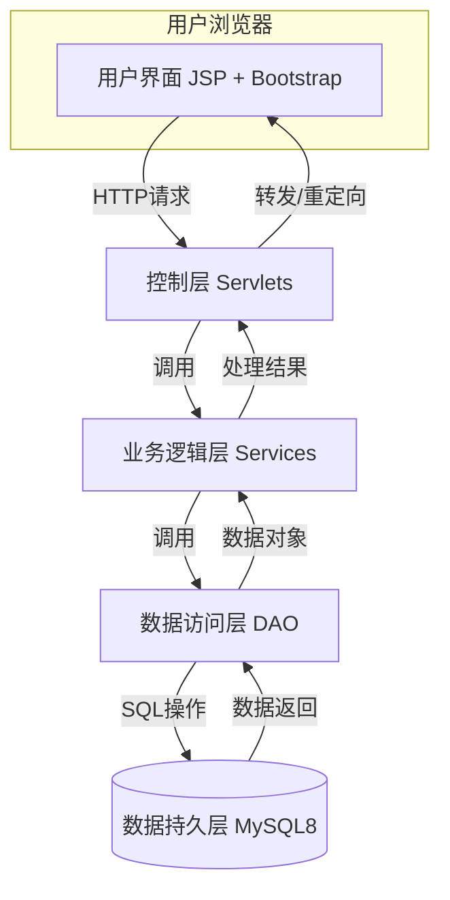
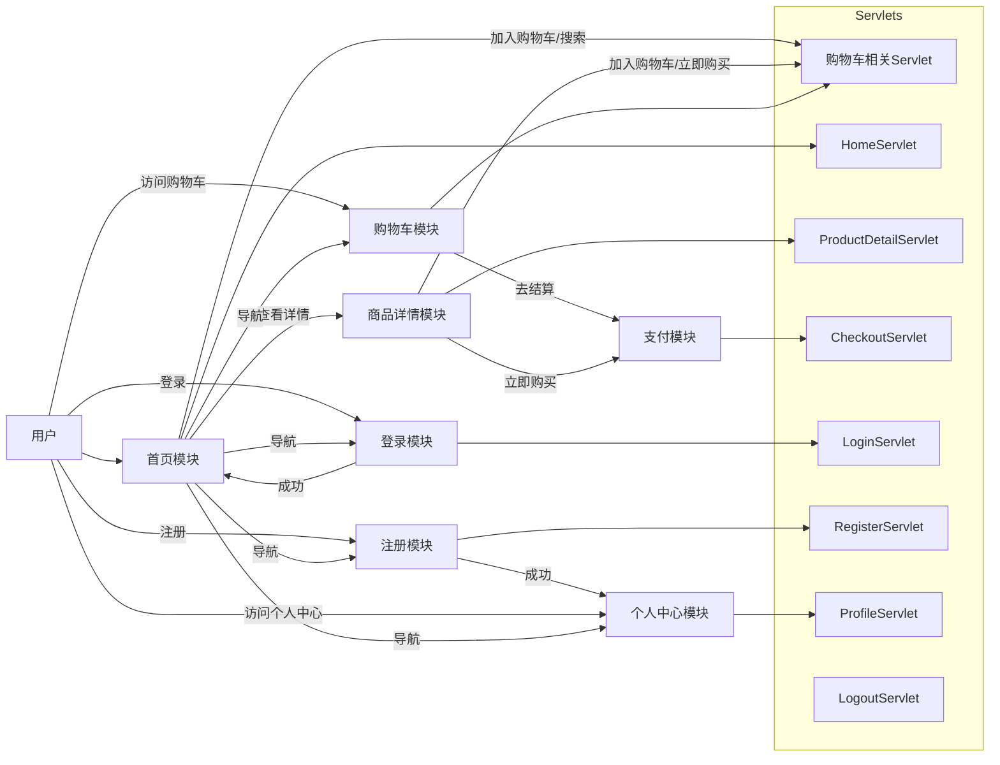
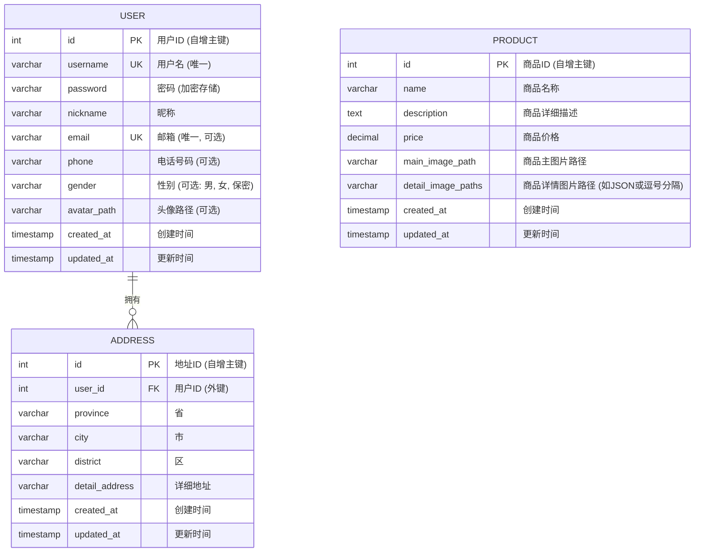
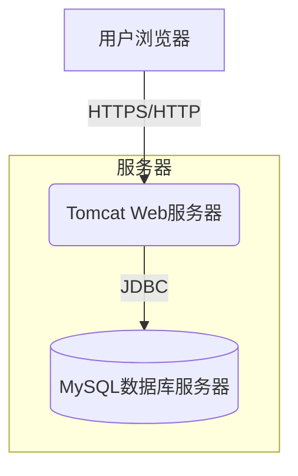

# 项目架构书 - JavaWeb 期末电商平台

## 1. 引言

### 1.1 项目背景
本文档是基于《需求建议书 (RFC) - JavaWeb 期末电商平台项目》编写的架构设计文档。该项目旨在开发一个功能简洁但完整的在线购物平台，作为 JavaWeb 课程的期末作业。

### 1.2 项目目标
- 实现一个基于 JSPServlet + Bootstrap + JSTL + MySQL8 技术栈的电商平台。
- 平台核心功能包括商品展示、搜索、购物车、模拟支付、用户注册登录以及个人中心。
- 在保证功能完整的前提下，追求实现方式的简洁性。
- 为用户提供流畅的基础在线购物体验。
- 巩固和运用 JavaWeb 相关技术。

### 1.3 项目范围
项目范围严格遵循需求建议书中定义的核心模块功能，不包含复杂的订单管理、在线客服、商品评价、促销活动及管理员后台等功能。

## 2. 架构设计原则

- **简洁性:** 采用直接和易于理解的技术实现方案，避免过度设计。
- **模块化:** 将系统划分为清晰定义的模块，降低耦合度，提高可维护性。
- **分层清晰:** 采用经典的分层架构，明确各层职责，便于开发和测试。
- **易用性:** 关注用户界面的直观性和操作流程的便捷性。
- **可靠性:** 确保核心功能的稳定运行和数据的准确性。

## 3. 系统架构

### 3.1 总体架构 (分层架构)

本项目采用经典的三层架构模型，结合 MVC 设计模式的思想进行实现：

- **表现层 (Presentation Layer):**
    - 技术: JSP, Bootstrap, JSTL, HTML, CSS, JavaScript。
    - 职责: 负责用户界面的展示、用户输入的接收以及将处理结果呈现给用户。主要由 JSP 页面和前端资源构成。
- **控制层 (Control Layer):**
    - 技术: Servlets。
    - 职责: 接收来自表现层的用户请求，调用业务逻辑层处理请求，并根据处理结果选择合适的视图进行响应。每个核心功能模块对应一个或多个 Servlet。
- **业务逻辑层 (Service Layer):**
    - 技术: Java 类和接口。
    - 职责: 实现项目的核心业务逻辑，如用户管理、商品管理、购物车操作等。Service 层调用 DAO 层与数据库交互。
- **数据访问层 (Data Access Layer - DAO):**
    - 技术: Java 类和接口, JDBC。
    - 职责: 提供数据持久化操作的接口和实现，负责与数据库进行交互，执行数据的增删改查操作。
- **数据持久层 (Data Persistence Layer):**
    - 技术: MySQL 8。
    - 职责: 存储和管理应用程序的持久化数据。

### 3.2 模块划分

根据需求建议书，系统主要包含以下模块：

1.  **首页模块 (Homepage Module):**
    *   职责: 商品列表展示、商品模糊搜索、快速加入购物车、网站导航。
    *   主要交互: 用户浏览商品、搜索商品、将商品加入购物车。
2.  **商品详情模块 (Product Detail Module):**
    *   职责: 展示特定商品的详细信息、图片、价格、描述，提供数量选择、加入购物车、立即购买功能，以及迷你商品导航。
    *   主要交互: 用户查看商品详情、调整购买数量、操作购买。
3.  **购物车模块 (Shopping Cart Module):**
    *   职责: 展示购物车内商品、调整商品数量、删除商品、清空购物车、计算总价、进行结算。
    *   主要交互: 用户管理购物车商品、发起结算。
4.  **支付模块 (Payment Module):**
    *   职责: 展示待支付商品信息、用户信息（可选）、总金额，模拟支付流程，显示支付成功页面。
    *   主要交互: 用户确认支付信息、完成模拟支付。
5.  **注册模块 (Registration Module):**
    *   职责: 处理新用户注册，包括用户名、密码的输入与校验。
    *   主要交互: 新用户填写注册信息、提交注册。
6.  **登录模块 (Login Module):**
    *   职责: 处理已注册用户登录，校验用户名和密码。
    *   主要交互: 用户输入登录凭证、提交登录。
7.  **个人中心模块 (Personal Center Module):**
    *   职责: 允许用户管理个人信息（昵称、电话、邮箱、性别）、修改密码、上传头像、管理收货地址。
    *   主要交互: 用户查看和修改个人资料。

## 4. 技术选型

- **后端:**
    - Java EE 8 (Servlet API 4.0, JSP 2.3): 作为项目核心技术，实现动态网页和业务逻辑处理。
    - JSTL 1.2 (JavaServer Pages Standard Tag Library): 简化 JSP 页面的开发，提高代码可读性和可维护性。
- **前端:**
    - Bootstrap (最新稳定版): 快速构建响应式、美观的用户界面。
    - HTML5, CSS3, JavaScript: 构建网页结构、样式和基本的前端交互。
- **数据库:**
    - MySQL 8: 关系型数据库，用于存储用户信息、商品信息等持久化数据。
- **Web 服务器:**
    - Apache Tomcat 9: Servlet 容器，用于部署和运行 JavaWeb 应用。
- **开发工具/环境:**
    - JDK 8 或更高版本
    - Maven (推荐): 项目构建和依赖管理。
    - IntelliJ IDEA / Eclipse: 集成开发环境。

选择理由：该技术栈符合课程要求，均为成熟、广泛应用的技术，拥有丰富的学习资源和社区支持，适合快速开发中小型 Web 应用。

## 5. 数据模型设计

### 5.1 实体关系图 (ERD)

**说明:**
- 购物车 (`Cart`) 和购物车项 (`CartItem`) 的信息将主要通过用户会话 (Session) 进行管理。当用户将商品加入购物车时，相关信息（商品ID、数量、价格等）存储在 Session 中的一个购物车对象里。
- 支付成功后，购物车中对应的商品将被清除。需求明确指出“无需在数据库中创建详细的订单记录”。

### 5.2 核心数据表结构

#### 1. 用户表 (`t_user`)
| 字段名         | 类型          | 约束/备注                      | 描述           |
|----------------|---------------|--------------------------------|----------------|
| `id`           | `INT`         | `PRIMARY KEY`, `AUTO_INCREMENT` | 用户ID (自增)   |
| `username`     | `VARCHAR(50)` | `UNIQUE`, `NOT NULL`           | 用户名         |
| `password`     | `VARCHAR(255)`| `NOT NULL`                     | 密码 (建议加密存储) |
| `nickname`     | `VARCHAR(50)` |                                | 用户昵称         |
| `email`        | `VARCHAR(100)`| `UNIQUE`                       | 邮箱 (个人中心补充,唯一) |
| `phone`        | `VARCHAR(20)` |                                | 电话号码 (个人中心补充) |
| `gender`       | `VARCHAR(10)` |                                | 性别 (男, 女, 保密) |
| `avatar_path`  | `VARCHAR(255)`|                                | 头像文件路径     |
| `created_at`   | `TIMESTAMP`   | `DEFAULT CURRENT_TIMESTAMP`    | 创建时间       |
| `updated_at`   | `TIMESTAMP`   | `DEFAULT CURRENT_TIMESTAMP ON UPDATE CURRENT_TIMESTAMP` | 更新时间       |

#### 2. 商品表 (`t_product`)
| 字段名               | 类型            | 约束/备注                      | 描述                 |
|----------------------|-----------------|--------------------------------|----------------------|
| `id`                 | `INT`           | `PRIMARY KEY`, `AUTO_INCREMENT` | 商品ID (自增)         |
| `name`               | `VARCHAR(255)`  | `NOT NULL`                     | 商品名称             |
| `description`        | `TEXT`          |                                | 商品详细描述         |
| `price`              | `DECIMAL(10,2)` | `NOT NULL`                     | 商品价格             |
| `main_image_path`    | `VARCHAR(255)`  |                                | 商品主图片路径       |
| `detail_image_paths` | `TEXT`          |                                | 商品详情图片路径列表 (例如 JSON 数组或逗号分隔字符串) |
| `created_at`         | `TIMESTAMP`     | `DEFAULT CURRENT_TIMESTAMP`    | 创建时间             |
| `updated_at`         | `TIMESTAMP`     | `DEFAULT CURRENT_TIMESTAMP ON UPDATE CURRENT_TIMESTAMP` | 更新时间             |

#### 3. 地址表 (`t_address`) (单一地址管理)
| 字段名           | 类型          | 约束/备注                      | 描述         |
|------------------|---------------|--------------------------------|--------------|
| `id`             | `INT`         | `PRIMARY KEY`, `AUTO_INCREMENT` | 地址ID (自增) |
| `user_id`        | `INT`         | `NOT NULL`, `FOREIGN KEY (t_user.id)` | 用户ID      |
| `province`       | `VARCHAR(50)` |                                | 省           |
| `city`           | `VARCHAR(50)` |                                | 市           |
| `district`       | `VARCHAR(50)` |                                | 区/县        |
| `detail_address` | `VARCHAR(255)`|                                | 详细地址     |
| `created_at`     | `TIMESTAMP`   | `DEFAULT CURRENT_TIMESTAMP`    | 创建时间     |
| `updated_at`     | `TIMESTAMP`   | `DEFAULT CURRENT_TIMESTAMP ON UPDATE CURRENT_TIMESTAMP` | 更新时间     |

## 6. 接口设计概述

### 6.1 Servlet 接口
Servlets 作为控制器，负责接收 HTTP 请求，解析参数，调用相应的 Service 方法处理业务逻辑，并将结果转发到合适的 JSP 页面或重定向。
- **URL 映射:** 每个核心功能模块或操作将映射到一个或多个 Servlet。例如：
    - `/home`: [`HomeServlet`](src/main/java/com/yycy/controller/HomeServlet.java:0) (处理首页展示和搜索)
    - `/product`: [`ProductDetailServlet`](src/main/java/com/yycy/controller/ProductDetailServlet.java:0) (处理商品详情页)
    - `/cart`: [`CartServlet`](src/main/java/com/yycy/controller/CartServlet.java:0) (处理购物车操作：添加、删除、更新数量)
    - `/checkout`: [`CheckoutServlet`](src/main/java/com/yycy/controller/CheckoutServlet.java:0) (处理结算和模拟支付)
    - `/login`: [`LoginServlet`](src/main/java/com/yycy/controller/LoginServlet.java:0)
    - `/register`: [`RegisterServlet`](src/main/java/com/yycy/controller/RegisterServlet.java:0)
    - `/logout`: [`LogoutServlet`](src/main/java/com/yycy/controller/LogoutServlet.java:0)
    - `/profile`: [`ProfileServlet`](src/main/java/com/yycy/controller/ProfileServlet.java:0) (处理个人中心信息修改)
    - `/validate`: [`ValidationServlet`](src/main/java/com/yycy/controller/ValidationServlet.java:0) (处理异步校验，如邮箱唯一性)
- **请求方法:** 根据操作类型使用 `doGet()` 或 `doPost()` 方法。
- **参数传递:** 通过 `request.getParameter()` 获取请求参数。
- **数据共享:** 使用 `request.setAttribute()` 将数据传递给 JSP 页面，使用 `session.setAttribute()` 管理用户会话信息。

### 6.2 Service 层接口
Service 层封装业务逻辑，提供清晰的接口供 Servlet 调用。
- 例如：
    - [`IUserService`](src/main/java/com/yycy/service/IUserService.java:0): `registerUser()`, `loginUser()`, `getUserById()`, `updateUserProfile()`, `changePassword()`, `updateAvatar()` 等。
    - [`IProductService`](src/main/java/com/yycy/service/IProductService.java:0): `getAllProducts()`, `searchProductsByName()`, `getProductById()` 等。
    - [`ICartService`](src/main/java/com/yycy/service/ICartService.java:0): `addItemToCart()`, `removeItemFromCart()`, `updateItemQuantity()`, `getCart()`, `clearCart()` (主要操作 Session 中的购物车对象)。
    - [`IAddressService`](src/main/java/com/yycy/service/IAddressService.java:0): `getAddressByUserId()`, `saveOrUpdateAddress()` 等。

### 6.3 DAO 层接口
DAO 层负责与数据库的直接交互。
- 例如：
    - [`IUserDao`](src/main/java/com/yycy/dao/IUserDao.java:0): `addUser()`, `findUserByUsername()`, `findUserById()`, `updateUser()`, `isEmailTaken()` 等。
    - [`IProductDao`](src/main/java/com/yycy/dao/IProductDao.java:0): `findAllProducts()`, `findProductsByName()`, `findProductById()` 等。
    - [`IAddressDao`](src/main/java/com/yycy/dao/IAddressDao.java:0): `findAddressByUserId()`, `addAddress()`, `updateAddress()` 等。
- **实现:** 使用 JDBC 连接数据库，执行 SQL 语句。

## 7. 部署架构

项目将部署在一个标准的 Web 服务器环境中。

- **应用服务器 (Tomcat):** 运行 Servlets 和 JSP 页面，处理用户请求和业务逻辑。
- **数据库服务器 (MySQL):** 存储所有持久化数据。
- 对于期末项目，通常 Tomcat 和 MySQL 可以部署在同一台物理机或虚拟机上。

## 8. 非功能性需求实现策略

### 8.1 易用性
- **界面设计:** 采用 Bootstrap 框架，确保界面简洁、直观、响应式。
- **操作流程:** 遵循用户常见的使用习惯设计导航和操作流程，如清晰的注册、登录、购物流程。
- **反馈机制:** 对于用户操作（如加入购物车、保存修改、支付成功），提供及时的、明确的提示信息。

### 8.2 可靠性
- **输入校验:** 在前端和后端对用户输入进行校验，防止非法数据导致系统错误（例如，注册时密码长度、确认密码一致性，个人中心邮箱格式等）。
- **异常处理:** 在 Servlet 和 Service 层进行适当的异常捕获和处理，对于关键操作（如数据库访问）使用 try-catch-finally 结构。提供友好的错误提示页面。
- **数据一致性:** 数据库操作应确保数据准确性，例如用户注册时用户名的唯一性，个人中心邮箱的唯一性校验。
- **Session 管理:** 妥善管理用户会话，确保登录状态的正确维持和安全退出。

### 8.3 技术栈符合性
- 严格按照需求建议书中指定的 JSPServlet + Bootstrap + JSTL + MySQL8 技术栈进行开发。
- 避免使用超出课程要求范围的复杂框架或技术。

## 9. 总结
本架构书为 JavaWeb 期末电商平台项目提供了高层次的架构设计方案。通过清晰的分层、模块化设计以及明确的技术选型，旨在指导项目的顺利开发，并满足需求建议书中提出的各项功能和非功能性要求。在后续的详细设计和开发过程中，应遵循本文档提出的原则和方案。